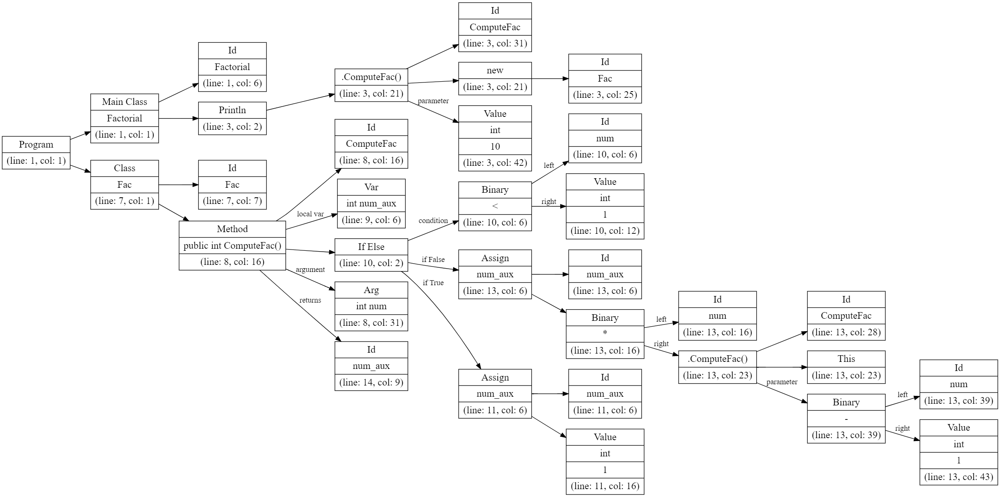

### Реализация компилятора на Python3! ###

На данный момент реализовано:

- [x] lex-лексер  
- [x] yacc-парсер  
- [x] abstract syntax tree  
- [x] symbol table
- [x] type checker
- [x] activation records

TODO:
- [ ] ir tree (в процессе)
- [ ] тесты (в процессе)
- [ ] результаты (в процессе)
- [ ] документация

Более подробное описание можно найти в папке docs.

### Разбор программы Factorial.java ###
**Code**
```java
class Factorial{
    public static void main(String[] a){
	System.out.println(new Fac().ComputeFac(10));
    }
}

class Fac {
    public int ComputeFac(int num){
	int num_aux ;
	if (num < 1)
	    num_aux = 1 ;
	else
	    num_aux = num * (this.ComputeFac(num-1)) ;
	return num_aux ;
    }
}
```


**Abstract Syntax Tree**
  

**Symbol Table**
```
class Factorial (line: 1, col: 1)
    fields:
    func public main (line: 1, col: 1)
        arguments:
            String [] a (line: 1, col: 1)

class Fac (line: 7, col: 1)
    fields:
    func public ComputeFac (line: 8, col: 5)
        arguments:
            int num (line: 8, col: 27)
        local variables:
            int num_aux (line: 9, col: 2)
```

**Activation Records**

```
Method name: main
this: Register 0
a: Register 1
FP: 0
SP: 0
Return address: Register 3
Exit address: Register 2
- - - - - - - - - - - - -

Method name: ComputeFac
this: Register 0
num: Register 1
FP: 0
num_aux: In frame position 0
SP: 4
Return address: Register 3
Exit address: Register 2
- - - - - - - - - - - - -
```