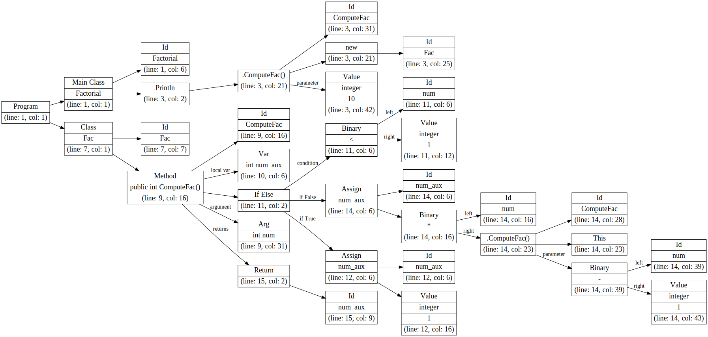
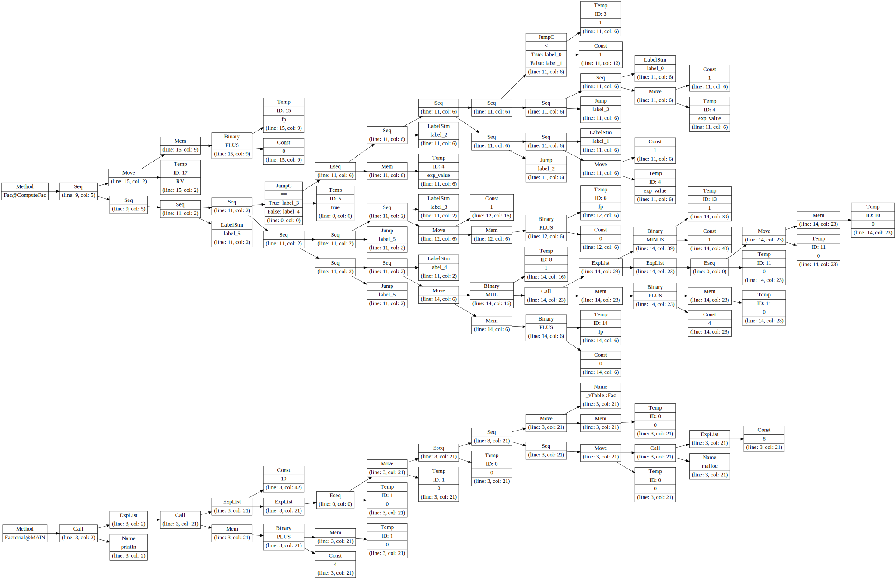
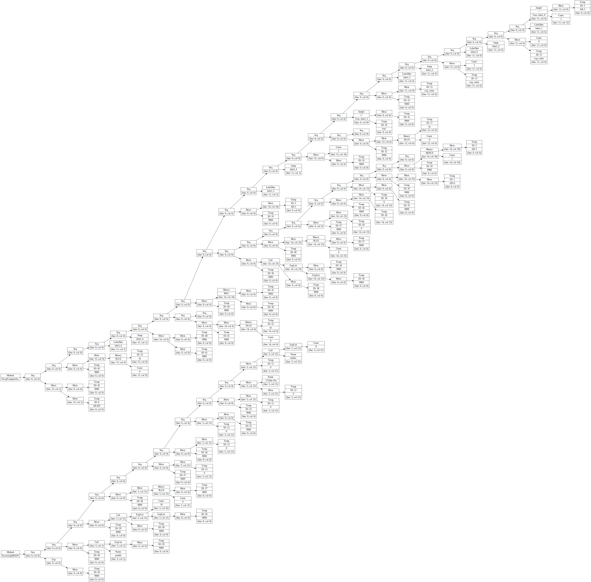
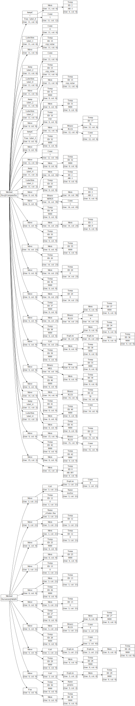
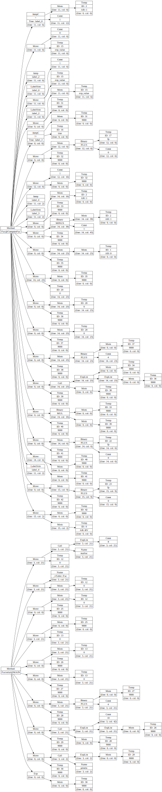
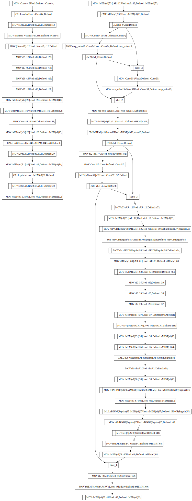

### Реализация компилятора на Python3! ###

На данный момент реализовано:

- [x] lex-лексер  
- [x] yacc-парсер  
- [x] abstract syntax tree  
- [x] symbol table
- [x] type checker
- [x] activation records
- [x] ir tree
- [x] canonized ir tree
- [x] linearized ir tree

TODO:

- [ ] тесты (в процессе)
- [ ] результаты (в процессе)
- [ ] документация

Более подробное описание можно найти в папке docs.

### Разбор программы Factorial.java ###
**Code**
```java
class Factorial{
    public static void main(String[] a){
	System.out.println(new Fac().ComputeFac(10));
    }
}

class Fac {
    public int ComputeFac(int num){
	int num_aux ;
	if (num < 1)
	    num_aux = 1 ;
	else
	    num_aux = num * (this.ComputeFac(num-1)) ;
	return num_aux ;
    }
}
```


**Abstract Syntax Tree**
  

**Symbol Table**
```
class Factorial (line: 1, col: 1)
    fields:
    func public main (line: 1, col: 1)
        arguments:
            String [] a (line: 1, col: 1)

class Fac (line: 7, col: 1)
    fields:
    func public ComputeFac (line: 8, col: 5)
        arguments:
            int num (line: 8, col: 27)
        local variables:
            int num_aux (line: 9, col: 2)
```

**Activation Records**

```
Method name: main
this: Register 0
a: Register 1
FP: 0
SP: 0
Return address: Register 3
Exit address: Register 2
- - - - - - - - - - - - -

Method name: ComputeFac
this: Register 0
num: Register 1
FP: 0
num_aux: In frame position 0
SP: 4
Return address: Register 3
Exit address: Register 2
- - - - - - - - - - - - -
```

**Intermediate Representation Tree**
  

**Canonized Intermediate Representation Tree**
  

**Linearized Intermediate Representation Tree**


**Reblocked Tree*


**Code Generation**
```
Factorial@MAIN
----------
MOV rConst44 8	Used:	Defined: rConst44;	Used: rConst44;
CALL malloc	Used: rConst44;	Defined:	Used: rConst44;	Defined:
MOV r12 rEAX1	Used: rEAX1;	Defined: r12;	Used: rEAX1;	Defined: r12;
MOV rName45_vTable::Fac	Used:	Defined: rName45;	Used: rName45;
MOV [rName45] r12	Used: rName45; r12;	Defined:	Used: rName45;	Defined: r12;	Defined:
MOV r25 r12	Used: r12;	Defined: r25;	Used: r12;	Defined: r25;
MOV r13 r25	Used: r25;	Defined: r13;	Used: r25;	Defined: r13;
MOV r26 r13	Used: r13;	Defined: r26;	Used: r13;	Defined: r26;
MOV r27 r13	Used: r13;	Defined: r27;	Used: r13;	Defined: r27;
MOV rMEM(e1)46 [r27]	Used: r27;	Defined: rMEM(e1)46;	Used: r27;	Defined: rMEM(e1)46;
MOV r28 [rMEM(e1)46+4]	Used: rMEM(e1)46;	Defined: r28;	Used: rMEM(e1)46;	Defined: r28;
MOV rConst48 10	Used:	Defined: rConst48;	Used: rConst48;
MOV rMEM(e1)49 [r26]	Used: r26;	Defined: rMEM(e1)49;	Used: r26;	Defined: rMEM(e1)49;
CALL [r28]	Used: rConst48; rMEM(e1)49; r28;	Defined:	Used: rConst48;	Defined: rMEM(e1)49;	Defined: r28;	Defined:
MOV r29 rEAX1	Used: rEAX1;	Defined: r29;	Used: rEAX1;	Defined: r29;
MOV rMEM(e1)51 [r29]	Used: r29;	Defined: rMEM(e1)51;	Used: r29;	Defined: rMEM(e1)51;
CALL println	Used: rMEM(e1)51;	Defined:	Used: rMEM(e1)51;	Defined:
MOV r30 rEAX1	Used: rEAX1;	Defined: r30;	Used: rEAX1;	Defined: r30;
MOV rMEM(e1)52 [r30]	Used: r30;	Defined: rMEM(e1)52;	Used: r30;	Defined: rMEM(e1)52;

Fac@ComputeFac
----------
MOV rMEM(e1)53 [rAR::12]	Used: rAR::12;	Defined: rMEM(e1)53;	Used: rAR::12;	Defined: rMEM(e1)53;
CMP rMEM(e1)53 1	Used: rMEM(e1)53;	Defined:	Used: rMEM(e1)53;	Defined:
JL label_0	Used:	Defined:	Used:
MOV rConst54 0	Used:	Defined: rConst54;	Used: rConst54;
MOV rexp_value15 rConst54	Used: rConst54;	Defined: rexp_value15;	Used: rConst54;	Defined: rexp_value15;
JMP label_2	Used:	Defined:	Used:
label_0:	Used:
MOV rConst55 1	Used:	Defined: rConst55;	Used: rConst55;
MOV rexp_value15 rConst55	Used: rConst55;	Defined: rexp_value15;	Used: rConst55;	Defined: rexp_value15;
label_2:	Used:
MOV r31 rexp_value15	Used: rexp_value15;	Defined: r31;	Used: rexp_value15;	Defined: r31;
MOV rMEM(e1)56 [r31]	Used: r31;	Defined: rMEM(e1)56;	Used: r31;	Defined: rMEM(e1)56;
CMP rMEM(e1)56 rtrue16	Used: rMEM(e1)56; rtrue16;	Defined:	Used: rMEM(e1)56;	Defined: rtrue16;	Defined:
JNE label_3	Used:	Defined:	Used:
MOV r32 [rfp17+0]	Used: rfp17;	Defined: r32;	Used: rfp17;	Defined: r32;
MOV rConst57 1	Used:	Defined: rConst57;	Used: rConst57;
MOV [rConst57] r32	Used: rConst57; r32;	Defined:	Used: rConst57;	Defined: r32;	Defined:
JMP label_4	Used:	Defined:	Used:
label_3:	Used:
MOV r33 rAR::12	Used: rAR::12;	Defined: r33;	Used: rAR::12;	Defined: r33;
MOV rMEM(e1)59 [rAR::12]	Used: rAR::12;	Defined: rMEM(e1)59;	Used: rAR::12;	Defined: rMEM(e1)59;
MOV rBINOP(Regular)58 rMEM(e1)59	Used: rMEM(e1)59;	Defined: rBINOP(Regular)58;	Used: rMEM(e1)59;	Defined: rBINOP(Regular)58;
SUB rBINOP(Regular)58 1	Used: rBINOP(Regular)58;	Defined: rBINOP(Regular)58;	Used: rBINOP(Regular)58;	Defined: rBINOP(Regular)58;
MOV r34 rBINOP(Regular)58	Used: rBINOP(Regular)58;	Defined: r34;	Used: rBINOP(Regular)58;	Defined: r34;
MOV rMEM(e1)60 [rAR::01]	Used: rAR::01;	Defined: rMEM(e1)60;	Used: rAR::01;	Defined: rMEM(e1)60;
MOV r35 [rMEM(e1)60]	Used: rMEM(e1)60;	Defined: r35;	Used: rMEM(e1)60;	Defined: r35;
MOV r20 r35	Used: r35;	Defined: r20;	Used: r35;	Defined: r20;
MOV r36 r20	Used: r20;	Defined: r36;	Used: r20;	Defined: r36;
MOV r37 r20	Used: r20;	Defined: r37;	Used: r20;	Defined: r37;
MOV rMEM(e1)61 [r37]	Used: r37;	Defined: rMEM(e1)61;	Used: r37;	Defined: rMEM(e1)61;
MOV r38 [rMEM(e1)61+4]	Used: rMEM(e1)61;	Defined: r38;	Used: rMEM(e1)61;	Defined: r38;
MOV rMEM(e1)63 [r34]	Used: r34;	Defined: rMEM(e1)63;	Used: r34;	Defined: rMEM(e1)63;
MOV rMEM(e1)64 [r36]	Used: r36;	Defined: rMEM(e1)64;	Used: r36;	Defined: rMEM(e1)64;
CALL [r38]	Used: rMEM(e1)63; rMEM(e1)64; r38;	Defined:	Used: rMEM(e1)63;	Defined: rMEM(e1)64;	Defined: r38;	Defined:
MOV r39 rEAX1	Used: rEAX1;	Defined: r39;	Used: rEAX1;	Defined: r39;
MOV rMEM(e1)66 [r33]	Used: r33;	Defined: rMEM(e1)66;	Used: r33;	Defined: rMEM(e1)66;
MOV rBINOP(Regular)65 rMEM(e1)66	Used: rMEM(e1)66;	Defined: rBINOP(Regular)65;	Used: rMEM(e1)66;	Defined: rBINOP(Regular)65;
MOV rMEM(e1)67 [r39]	Used: r39;	Defined: rMEM(e1)67;	Used: r39;	Defined: rMEM(e1)67;
IMUL rBINOP(Regular)65 rMEM(e1)67	Used: rMEM(e1)67;	Defined: rBINOP(Regular)65;	Used: rMEM(e1)67;	Defined: rBINOP(Regular)65;
MOV r40 rBINOP(Regular)65	Used: rBINOP(Regular)65;	Defined: r40;	Used: rBINOP(Regular)65;	Defined: r40;
MOV r41 [rfp22+0]	Used: rfp22;	Defined: r41;	Used: rfp22;	Defined: r41;
MOV rMEM(e1)68 [r41]	Used: r41;	Defined: rMEM(e1)68;	Used: r41;	Defined: rMEM(e1)68;
MOV rMEM(e1)68 r40	Used: r40;	Defined: rMEM(e1)68;	Used: r40;	Defined: rMEM(e1)68;
label_4:	Used:
MOV r42 [rfp23+0]	Used: rfp23;	Defined: r42;	Used: rfp23;	Defined: r42;
MOV rMEM(e1)69 [rAR::RV0]	Used: rAR::RV0;	Defined: rMEM(e1)69;	Used: rAR::RV0;	Defined: rMEM(e1)69;
MOV rMEM(e1)69 r42	Used: r42;	Defined: rMEM(e1)69;	Used: r42;	Defined: rMEM(e1)69;
```

**Lifecycle Graph**

